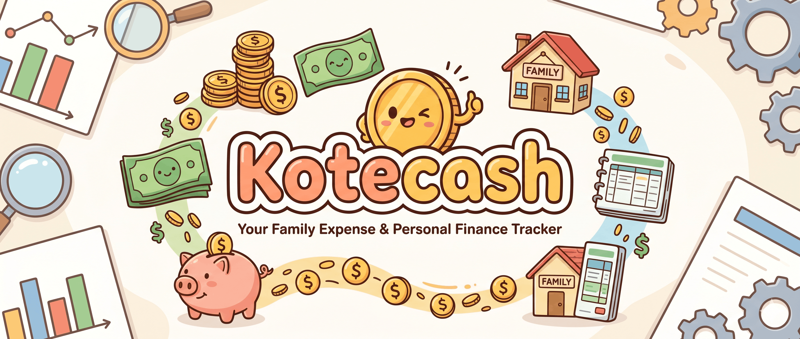

<p align="center">
  
</p>

# KoteCash

A self-hosted household finance ledger. Single Cloudflare Worker: **Astro SSR** pages + **Hono** REST API + **D1** database. Runs entirely on the Cloudflare **free plan**.

Built around one **movements ledger**: every money movement is one row with an explicit source and destination account. Balances, budgets, and net-worth are all derived from movements — nothing is stored twice.

## Features

- **Movements ledger** — every transaction is one row (`source → destination`). Income is `outside → wallet`, expense is `wallet → outside`, transfers move between any two accounts. All balances are computed from this — no double-entry, no drift.
- **Accounts** — track **wallets** (bank / e-wallet / cash), **deposits** (with interest & maturity), **investment portfolios** (value snapshots over time), **credit cards** (limits, statements, utilization), and **cicilan** / installment debt (amortization schedule, remaining balance).
- **Budgets** — set a monthly cap per category; the dashboard shows live actual-vs-budget with UNDER / ON TRACK / OVER status. Fixed debt payments are auto-excluded.
- **Goals & earmarks** — set a savings target and virtually allocate funds from any account toward it, without moving real money. Spend from an earmarked balance and the app warns you.
- **Recurring payments** — define templates (monthly salary, rent, bills) that auto-generate movements on schedule; they sweep lazily each time the dashboard loads.
- **Dashboard & net-worth trend** — current-month income, expense, savings rate, debt-to-income ratio, total liquid/assets, and a reconstructed 6-month net-worth history.
- **AI-agent API** — a bearer-token REST API lets an AI agent read and write your ledger for you (log transactions, move money, report financial health). Full reference in [`docs/SKILL.md`](docs/SKILL.md).

## Tech stack
Astro + Hono + Cloudflare D1, Tailwind, vitest. No separate backend service — pages and `/api/*` are served from the same Worker (same-origin, no CORS).

---

## Deploy to Cloudflare (one click)

The fastest way to get a running instance. Provisions the D1 database, applies migrations, builds, and deploys — all on the free plan.

[](https://deploy.workers.cloudflare.com/?url=https://github.com/dkotama/kotecash-bookeeping)

> Replace the repo URL above with your own once published. The button reads `wrangler.toml` + `package.json` from the repo to auto-provision D1 and run migrations on deploy.

After it finishes, open your new `*.workers.dev` URL and do step 5 below (change the default password).

---

## Manual setup on your own Cloudflare (free plan)

### Prerequisites
- A [Cloudflare account](https://dash.cloudflare.com/sign-up) (free)
- Node.js 18+
- `npm install`

### 1. Create the D1 database
```bash
npx wrangler d1 create kotecash-db
```
Copy the printed `database_id` into `wrangler.toml` (the `database_id = ""` line).

### 2. Configure wrangler
`wrangler.toml` ships as a sanitized template. Edit it and fill in:
- `database_id` — from step 1 (the `"Deploy to Cloudflare"` button fills this automatically; for manual setup you set it)
- (optional) `routes` — add a custom domain, or leave `workers_dev = true` for the free `*.workers.dev` URL

### 3. Apply migrations
```bash
npx wrangler d1 migrations apply kotecash-db --remote
```

### 4. Build & deploy
```bash
npm run build
npm run deploy     # runs migrations (via the DB binding) then `wrangler deploy`
```

### 5. First login — change the default password immediately

When the D1 `users` table is empty, the app auto-seeds a default admin on first login:

| | |
|---|---|
| **Email** | `admin@example.com` |
| **Password** | `admin` |

> ⚠️ **CHANGE THIS AS SOON AS POSSIBLE.** These defaults are public — anyone who finds your URL can log in until you do.

After logging in: open **Settings → Account → Change Password** and set a real password. (You can also update it directly in D1 if you're locked out — see [Security notes](#security-notes).)

### 6. (Optional) Load demo data
To see every feature populated (categories, wallets, deposits, portfolios, credit cards, cicilan, goals, budgets, recurring, and ~5 months of movements), load the sample seed. Log in once first so the admin user (`user_id = 1`) exists, then:
```bash
npx wrangler d1 execute kotecash-db --remote --file db/seed.sql
```
Reload the app to browse the demo household. Clear it anytime with the `DELETE` statements at the top of [`db/seed.sql`](db/seed.sql).

### 6. (Optional) Custom domain
In `wrangler.toml`, set `routes = [{ pattern = "your-domain.com", custom_domain = true }]` and add the domain to your Cloudflare account. Otherwise leave `workers_dev = true` and use the free `*.workers.dev` URL.

### Local development
```bash
npm run dev                  # Astro dev server (local pages)
# D1 locally:
npx wrangler d1 migrations apply kotecash-db --local
npm test                     # vitest
```

---

## Setup for your AI agent

The ledger exposes a REST API an AI agent can call with a bearer token. The full endpoint reference is the **Skill doc** at [`docs/SKILL.md`](docs/SKILL.md) (also served live at `/ai` on your deployment).

### 1. Generate an API token
Log into your deployment → open the **API & AI** page → **Generate** a token (give it a label). The full token (`kote_...`) is shown **once** — copy it.

Or via API directly (after logging in, the cookie authorizes this):
```bash
curl -X POST https://your-deployed-url/api/tokens \
  -H "Content-Type: application/json" \
  -d '{"label":"my-agent"}'
# → { "id": 1, "token": "kote_...", "prefix": "kote_xxx..." }
```

### 2. Point your agent at the API
Give your agent two things:
- **Base URL:** `https://your-deployed-url`
- **Auth header on every request:** `Authorization: Bearer kote_...`

Then attach the contents of `docs/SKILL.md` as the agent's skill/instructions. That doc tells the agent the full movements model, endpoint list, and setup order.

### 3. Quick check
```bash
TOKEN="kote_..."

# Create a category, capture its id
curl -s -X POST https://your-deployed-url/api/categories \
  -H "Authorization: Bearer $TOKEN" -H "Content-Type: application/json" \
  -d '{"name":"Groceries","type":"expense"}'

# Log an expense from wallet 1
curl -s -X POST https://your-deployed-url/api/movements \
  -H "Authorization: Bearer $TOKEN" -H "Content-Type: application/json" \
  -d '{"date":"2026-06-21","amount":45000,"category_id":1,"src_kind":"wallet","src_id":1,"dst_kind":null,"dst_id":null,"description":"Lunch"}'

# This month's financial health
curl -s https://your-deployed-url/api/dashboard -H "Authorization: Bearer $TOKEN"
```

A `401 {"error":"Unauthorized"}` means the token is invalid or revoked — regenerate it.

---

## Security notes
- Passwords use **unsalted SHA-256** — adequate for a personal/single-household instance, but don't host real financial data for many users without upgrading to a real KDF (bcrypt/argon2).
- API tokens are SHA-256 hashed at rest; the full `kote_...` value is shown only once at creation.
- Treat your `wrangler.toml` (account/database IDs) and `.env` (Cloudflare API token) as secrets — both are gitignored.

### Locked out? Reset a password directly in D1
```bash
printf '%s' 'YOUR_NEW_PASSWORD' | sha256sum
npx wrangler d1 execute kotecash-db --remote \
  --command "UPDATE users SET password_hash='<hash-from-above>' WHERE email='admin@example.com'"
```

## License
MIT
