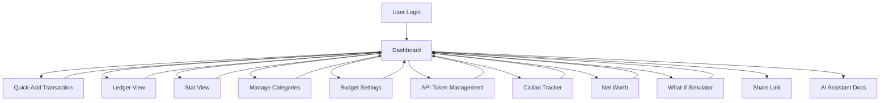
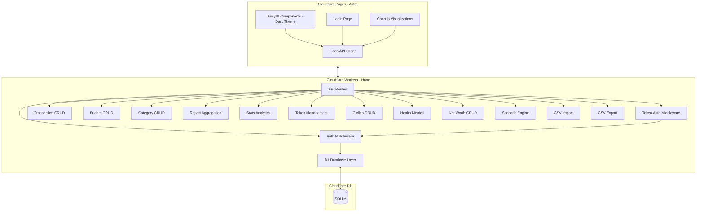

# Internal Technical Specification: kotecash v0.2

> Revisi dari v0.1 — menambahkan: cicilan tracker, financial health scoring, net worth, what-if simulator, budget variance, CSV import/export, share link.
> Reference: hasil belajar dari spreadsheet Family Finance Manager (Google Sheets).

## 1. Scope of Work

### In Scope
- **Authentication** — Password-based login to protect financial data
- **API Token Management** — Generate, list, rename, and revoke long-lived API tokens for AI agents
- **Dashboard** — Summary view: current month totals, savings rate + health score, DTI gauge, 50/30/20 rule indicator, top spending categories, budget progress bars, quick-add
- **Ledger View** — Full transaction ledger: paginated, sorted by date desc, running balance, inline edit/delete, search by notes, filter by date range + category + type + payment method
- **Stat View** — Analytics & charts: monthly income vs expense bar chart, category spending pie chart, spending trend line, budget variance chart, net worth line chart
- **Category Management** — Predefined seed categories + custom category creation (income/expense)
- **Monthly Budgeting** — Set spending limits per category per month, budget vs actual with auto variance labeling (🛑OVER / 💚UNDER / ✅ON TRACK)
- **Cicilan (Installment) Tracker** — Track recurring debt: total amount, remaining principal, monthly payment, tenor, interest rate, start date, due date, status (active/paid off)
- **Financial Health Scoring** — Auto-calculated metrics: Savings Rate (with benchmark tiers), Debt-to-Income ratio, 50/30/20 rule check, overall health rating
- **Net Worth Tracker** — Monthly snapshot: assets minus liabilities, Δ month-over-month, time-series visualization
- **What-If Simulator** — Scenario modeling: "income +10%", "expense -20%", show resulting savings rate change
- **CSV Import / Export** — Import transactions from bank CSV exports; export ledger/full data as CSV
- **Read-Only Share Link** — Generate shareable link for family member to view dashboard + stats (no edit)
- **AI Assistant Integration** — Native skill module for AI agents (Hermes, etc.) to programmatically access kotecash via API token; includes documented endpoints, SKILL.md for agent compatibility

### Out of Scope
- Multi-user / team access (except read-only share link)
- Multi-currency support (IDR only)
- Investment / portfolio tracking
- Bank API integration (Plaid, etc.)
- Receipt uploads / OCR
- Recurring / scheduled transactions (v0.3)
- Mobile native app (PWA via Astro is acceptable)
- Adat/Kampung as separate module (treated as regular categories with budgets)

## 2. Tech Stack

| Layer | Technology |
|---|---|
| **Frontend** | Astro + Tailwind CSS + DaisyUI |
| **Backend API** | Hono (Cloudflare Workers) |
| **Database** | Cloudflare D1 (SQLite) |
| **Authentication** | Password-based (bcrypt, session cookie) + Bearer token (SHA-256 hashed) |
| **Charts** | Chart.js (CDN, lightweight) |
| **Hosting** | Cloudflare Pages (frontend) + Cloudflare Workers (API) |
| **Deployment** | Wrangler CLI, monorepo structure |
| **PWA** | Astro PWA integration (offline-capable, installable) |

## 3. Application Flow



## 4. Technical Architecture



## 5. Functional Requirements

### Auth (unchanged)
- FR-1: User login with email/username + password
- FR-2: Session cookie + Bearer token dual auth

### Transaction (enhanced)
- FR-3: CRUD transactions with: date, amount (IDR), category, type (income/expense), notes, **payment_method** (cash, transfer, CC, OVO, GoPay, etc.)
- FR-4: Ledger View: paginated, date desc, running balance, search notes, filter date/category/type/**payment_method**
- FR-5: Stat View: income vs expense bar, category pie, spending trend line, **budget variance chart**, **net worth line**

### Category (unchanged)
- FR-6: Predefined seed categories (food, transport, utilities, salary, BRI cicilan, CC, PAK AYAN, BERAS, CANANG, etc.)
- FR-7: Custom category CRUD, separate income vs expense lists

### Budget (enhanced)
- FR-8: Monthly budget per category (IDR)
- FR-9: Dashboard shows budget progress bars
- FR-10: **Auto variance labeling**: 🛑OVER if actual > budget, 💚UNDER if actual < budget, ✅ON TRACK if equal

### Cicilan (NEW)
- FR-11: CRUD cicilan (installments): name, total_utang, sisa_pokok, cicilan_per_bulan, tenor, bunga_persen, mulai, jatuh_tempo, status
- FR-12: Auto-calculate remaining months from sisa_pokok / cicilan_per_bulan
- FR-13: Dashboard shows upcoming cicilan due this month
- FR-14: Transactions can reference cicilan (optional FK) to auto-track payments

### Financial Health (NEW)
- FR-15: **Savings Rate** = (Income - Expense) / Income × 100, with tier: <10% Needs Improvement, 10-20% Good, 20-30% Excellent, >30% Outstanding
- FR-16: **Debt-to-Income (DTI)** = Total Cicilan Bulanan / Income Bulanan, with tier: <30% Healthy, 30-50% High, >50% Critical
- FR-17: **50/30/20 Rule Check**: Needs ≤50% income, Wants ≤30%, Savings ≥20% — auto-label each
- FR-18: Overall health score card on Dashboard with color indicators (green/yellow/red)

### Net Worth (NEW)
- FR-19: Monthly snapshot: Assets (cash, tabungan) minus Liabilities (total outstanding cicilan)
- FR-20: Auto-calculate Δ month-over-month
- FR-21: Time-series line chart on Stat View

### What-If Simulator (NEW)
- FR-22: Input: income change (+/- % or absolute), expense change
- FR-23: Output: new savings rate, new DTI, new 50/30/20 breakdown
- FR-24: Compare side-by-side with current values

### Import/Export (NEW)
- FR-25: CSV import: parse bank export format (date, description, amount), auto-detect type, map to categories
- FR-26: CSV export: full ledger or filtered view

### Share Link (NEW)
- FR-27: Generate read-only share link for Dashboard + Stats
- FR-28: Link is revocable, shows limited data (no edit, no token management)

### AI Assistant (NEW)
- FR-29: `/api/health` endpoint returns all aggregated health metrics (savings rate, DTI, 50/30/20) in single JSON response
- FR-30: `/api/dashboard` endpoint returns current month totals, top categories, budget progress, upcoming cicilan
- FR-31: All AI-accessible endpoints accept `Authorization: Bearer <token>` header generated from API Token Management
- FR-32: SKILL.md published at `/ai/` route with full API documentation, curl examples for every endpoint, and token usage instructions
- FR-33: AI agents can CRUD transactions, read budgets, read cicilan, read health metrics via API
- FR-34: Write operations (POST/PUT/DELETE) require valid non-revoked token; read operations require valid token

### API Token (unchanged)
- FR-35-40: Same as v0.1 (generate, list, revoke, SHA-256 hash, shown once)

## 6. Non-Functional Requirements

- NFR-1: Page load ≤ 2s on 4G (Cloudflare edge)
- NFR-2: API response ≤ 500ms CRUD (excluding D1 cold start)
- NFR-3: D1 daily backups via `wrangler d1 backup`
- NFR-4: Auth session 24h inactivity expiry
- NFR-5: Dual auth (cookie + Bearer token)
- NFR-6: D1 indexed columns (date, category_id, type, payment_method, cicilan_id)
- NFR-7: Workers free tier compatible (100k req/day)
- NFR-8: **Pure light theme** — `#F7F8F0` cream base, no dark mode toggle
- NFR-9: **PWA capable** — offline dashboard view, installable to home screen
- NFR-10: **Mobile-first responsive** — all views work on 375px width
- NFR-11: Chart rendering ≤ 1s for typical household data (<10K rows)

## 7. List of Modules

| # | Module | Status | Description |
|---|---|---|---|
| 1 | Auth Module | v0.1 → unchanged | Login, session, password hashing, middleware |
| 2 | API Token Module | v0.1 → unchanged | Generate/list/revoke tokens, SHA-256 storage |
| 3 | Transaction Module | **Enhanced** | +payment_method field, +cicilan_id FK, CSV import/export |
| 4 | Ledger View Module | **Enhanced** | +payment_method filter column, +cicilan reference column |
| 5 | Stat View Module | **Enhanced** | +budget variance chart, +net worth line chart |
| 6 | Category Module | **Enhanced** | Predefined seed categories include cicilan & adat items |
| 7 | Budget Module | **Enhanced** | +auto variance label (OVER/UNDER/ON TRACK), +variance % |
| 8 | Dashboard Module | **Major enhance** | +health score card, +DTI gauge, +50/30/20 indicator, +upcoming cicilan |
| 9 | **Cicilan Module** | **NEW** | Installment CRUD, remaining calc, due date tracking |
| 10 | **Health Module** | **NEW** | Savings rate, DTI, 50/30/20, overall score API + UI |
| 11 | **Net Worth Module** | **NEW** | Monthly snapshot CRUD, Δ MoM, time-series chart |
| 12 | **Scenario Module** | **NEW** | What-if calculator: income/expense changes → new metrics |
| 13 | **Share Module** | **NEW** | Generate/revoke read-only share link |
| 14 | **AI Assistant Module** | **NEW** | SKILL.md with API endpoint docs, curl examples, token usage guide for AI agents |

## 8. Database Schema (New Tables)

```sql
-- Existing (v0.1): users, categories, transactions, budgets, api_tokens

-- NEW: cicilan (installments)
CREATE TABLE cicilan (
  id INTEGER PRIMARY KEY AUTOINCREMENT,
  user_id INTEGER NOT NULL REFERENCES users(id),
  nama TEXT NOT NULL,
  total_utang INTEGER NOT NULL,        -- in IDR
  sisa_pokok INTEGER NOT NULL,         -- remaining principal
  cicilan_per_bulan INTEGER NOT NULL,
  tenor_bulan INTEGER,                 -- original tenor
  bunga_persen REAL DEFAULT 0,
  mulai TEXT,                          -- start date
  jatuh_tempo TEXT,                    -- due date
  status TEXT DEFAULT 'active',        -- active / paid_off
  catatan TEXT,
  created_at TEXT DEFAULT (datetime('now')),
  updated_at TEXT DEFAULT (datetime('now'))
);

-- NEW: net_worth_snapshots
CREATE TABLE net_worth_snapshots (
  id INTEGER PRIMARY KEY AUTOINCREMENT,
  user_id INTEGER NOT NULL REFERENCES users(id),
  bulan TEXT NOT NULL,                 -- '2026-06'
  assets INTEGER NOT NULL DEFAULT 0,   -- total cash + savings
  liabilities INTEGER NOT NULL DEFAULT 0, -- total outstanding cicilan
  created_at TEXT DEFAULT (datetime('now'))
);

-- ALTER: transactions
ALTER TABLE transactions ADD COLUMN payment_method TEXT DEFAULT 'cash';
ALTER TABLE transactions ADD COLUMN cicilan_id INTEGER REFERENCES cicilan(id);

-- ALTER: budgets
ALTER TABLE budgets ADD COLUMN variance_label TEXT;  -- computed on read
```

## 9. Key Design Decisions

| Decision | Rationale |
|---|---|
| Adat expenses as regular categories | User confirmed: adjust budget per month, no separate module needed |
| Dark theme default | User preference from Google Sheets experience |
| PWA not native app | Astro PWA plugin covers mobile needs without dual codebase |
| CSV import before bank API | Lower complexity; most Indonesian banks export CSV from mobile app |
| D1 for everything | Single DB, no additional services, free tier sufficient |
| Chart.js over heavier lib | CDN-loaded, zero bundle size impact on Astro |
| Health metrics computed server-side | Ensures consistency; D1 aggregation is fast on indexed columns |
