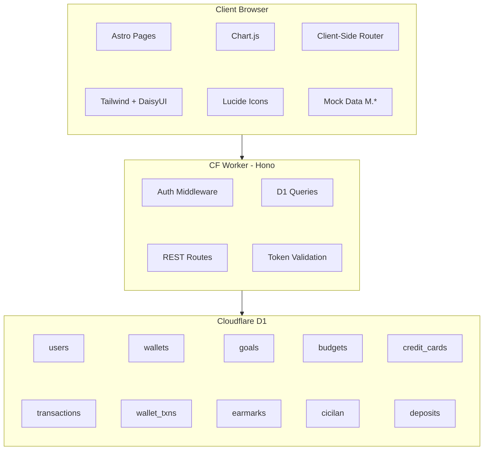
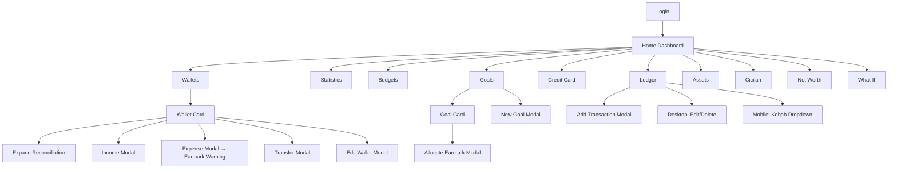

# kotecash — Internal Technical Specification (v3.1)

> Generated from: final mockup HTML + conversation context
> Status: Production-ready reference for coding agent
> Mockup: `docs/initial/sample_pages/index.html` (2178 lines, `node --check` validated)
> Stack: Astro + Hono + TailwindCSS + DaisyUI + Chart.js + Lucide + Cloudflare D1 + CF Workers

---

## 1. Scope of Work

### In Scope
- **Dashboard (Home):** Income/Expense/Sisa summary, Liquid (Free + Earmarked), CC Debt, Assets, Net Worth, Monthly Flow health badge, DTI, Goals snapshot, Budget progress bars, Upcoming Payments (Cicilan + CC due dates), month/year filter dropdowns
- **Ledger:** Transaction log with compact card-row layout, desktop edit/delete buttons, mobile kebab (⋯) dropdown, search + category + type filters
- **Statistics:** Income vs Expense bar chart, Spending by Category doughnut chart (Chart.js)
- **Categories:** CRUD expense + income categories
- **Budgets:** Monthly budget limits per category, progress bars, UNDER/ON TRACK/OVER badges
- **Credit Card:** Card balances, utilization %, statement/due days, min payment, interest rate, annual fee
- **Wallets:** Bank accounts + e-wallets + cash, balance computed from walletTxns (reconcilable), Income/Expense/Transfer/Edit/Delete, expandable reconciliation breakdown, activity log, earmark overspend warning
- **Cicilan:** Active installments with progress bars, monthly payment, interest rate, due date, expandable amortization schedule
- **Net Worth:** Assets / Liabilities / Net Worth cards, trend line chart (Chart.js)
- **What-If Simulator:** Income/Expense sliders, scenario cards, comparison chart, detailed breakdown table
- **Goals:** Savings targets with progress bars, earmark allocation from wallets/deposits/portfolios, Allocate, New Goal, Edit Goal, Delete Goal
- **Earmarks:** Virtual allocation tagging — source (wallet/asset) → goal. Create, Delete. Does not move actual money.
- **Earmark Warning:** When wallet expense exceeds `walletFree(name)`, alert identifies impacted goals
- **Assets:** Deposits (bank, amount, rate, tenor, maturity) + Investment Portfolios (RDN accounts). Full CRUD.
- **Account:** Change password, account info display
- **API & AI:** Token management (create, list, revoke), endpoint reference table, quick-start curl example
- **Month/Year Filter:** Home page period selector

### Out of Scope
- Real bank API / OVO / GoPay integration
- Multi-user / auth beyond single-user password
- Dark mode
- PDF export / email reports
- Mobile native app (web-responsive only)
- OCR receipt scanning
- Automated bank statement import

---

## 2. Core Formulas (Must Be Implemented)

Every formula below must be a pure function with no side effects. All return IDR amounts unless noted.

### Wallet Balance
```
walletBalance(name):
  sum = 0
  FOR EACH txn IN walletTxns WHERE txn.wallet == name:
    IF txn.type IN ('income', 'transfer_in'):
      sum += txn.amount
    ELSE:
      sum -= txn.amount
  RETURN sum
```

### Wallet Earmarked
```
walletEarmarked(name):
  RETURN SUM(earmark.amount) FOR earmark IN earmarks WHERE earmark.source == name
```

### Wallet Free (spendable without hitting goals)
```
walletFree(name):
  RETURN walletBalance(name) - walletEarmarked(name)
```

### Goal Progress
```
goalProgress(goalName):
  RETURN SUM(earmark.amount) FOR earmark IN earmarks WHERE earmark.goal == goalName
```

### Dashboard Aggregates
```
totalLiquid     = SUM(walletBalance(w.name)) FOR w IN wallets
totalCC         = SUM(cc.balance) FOR cc IN creditCards
totalDeposits   = SUM(d.amount) FOR d IN deposits WHERE d.status == 'active'
totalPortfolios = SUM(p.value) FOR p IN portfolios
totalAssets     = totalDeposits + totalPortfolios
totalCicilanSisa = SUM(c.sisa) FOR c IN cicilan WHERE c.status == 'active'
netWorth        = totalLiquid + totalAssets - totalCC - totalCicilanSisa
totalEarmarked  = SUM(e.amount) FOR e IN earmarks
walletOnlyEarmarked = SUM(e.amount) FOR e IN earmarks WHERE e.source IN (wallets names)
totalFree       = totalLiquid - walletOnlyEarmarked
```

### Income / Expense / Sisa
```
income  = SUM(t.amount) FOR t IN transactions WHERE t.type == 'income' AND t.date in period
expense = SUM(t.amount) FOR t IN transactions WHERE t.type == 'expense' AND t.date in period
sisa    = income - expense
```

### Savings Rate (potential, not actual savings)
```
savingsRate = (income - expense) / income   // 0 if income == 0
DTI         = total_monthly_debt / income   // 0 if income == 0
  WHERE total_monthly_debt = SUM(c.monthly) FOR c IN cicilan WHERE c.status == 'active'
```

### Health Tier (Savings Rate)
```
savingsRate >= 0.30 → 'Outstanding' (green, award icon)
savingsRate >= 0.20 → 'Excellent'   (blue,  star icon)
savingsRate >= 0.10 → 'Good'        (amber, thumbs-up icon)
otherwise           → 'Needs Improvement' (red, alert-triangle icon)
```

### DTI Tier
```
DTI < 0.30  → 'Healthy'  (green)
DTI < 0.50  → 'High'     (amber)
otherwise   → 'Critical' (red)
```

### Budget Status
```
ratio = actual / budget (budget > 0)
ratio > 1.00    → 'OVER'      (red, alert-triangle icon)
ratio > 0.90    → 'ON TRACK'  (blue, check-circle icon)
otherwise       → 'UNDER'     (green, check-circle-2 icon)
```

### CC Utilization Color
```
utilization = balance / limit
utilization > 50% → red (c-danger)
utilization > 30% → amber (c-warning)
otherwise         → green (c-success)
```

### Cicilan Amortization Schedule
```
remaining = cicilan.sisa
monthlyRate = cicilan.bunga / 100 / 12
FOR month = 1 TO monthsLeft:
  interestPayment  = ROUND(remaining * monthlyRate)
  principalPayment = monthly - interestPayment
  IF month == monthsLeft: principalPayment = remaining; interestPayment = monthly - principalPayment
  remaining -= principalPayment
  record month, monthly, principalPayment, interestPayment, remaining
```

### Transfer Double-Entry
```
applyTransfer(from, to, amount, notes):
  // Must happen atomically
  INSERT walletTxn { wallet: from, type: 'transfer_out', amount, target: to, desc: notes }
  INSERT walletTxn { wallet: to,   type: 'transfer_in',  amount, source: from, desc: notes }
  INSERT transfer { from, to, amount, notes }
  // Wallet balance is derived, not stored — no manual update needed
```

### Earmark Warning
```
applyWalletExpense(wallet, amount):
  free = walletFree(wallet.name)
  IF amount > free:
    into = amount - free
    impacted = DISTINCT(earmark.goal) FOR earmark IN earmarks WHERE earmark.source == wallet.name
    ALERT: "Warning: Spending Rp{amount} exceeds free balance (Rp{free}). Rp{into} will come from earmarked goals: {impacted}"
  // Transaction still recorded despite warning
```

### Scenario (What-If) Formulas
```
newIncome   = income * (1 + incomeChangePct / 100)
newExpense  = expense * (1 + expenseChangePct / 100)
newNet      = newIncome - newExpense
newSR       = newIncome > 0 ? newNet / newIncome : 0
newDTI      = newIncome > 0 ? total_monthly_debt / newIncome : 0
```

### Net Worth Delta
```
currentNW = lastMonth.assets - lastMonth.liabilities
previousNW = previousMonth.assets - previousMonth.liabilities
delta = currentNW - previousNW
```

---

## 3. Complete CRUD Matrix

✅ = in mockup HTML | ⚠️ = documented but NOT in HTML (must build)

### Wallets
| Operation | HTML | Endpoint | Notes |
|-----------|------|----------|-------|
| Create | ⚠️ | `POST /api/wallets` | Add wallet modal not in mockup |
| Read (list) | ✅ | `GET /api/wallets` | Expandable cards + reconciliation |
| Update | ✅ | `PUT /api/wallets/:id` | Edit name, balance, account number |
| Delete | ⚠️ | `DELETE /api/wallets/:id` | Must cascade: delete walletTxns, transfers, earmarks referencing this wallet |
| Add Income | ✅ | `POST /api/wallets/:id/income` | Creates walletTxn type=income |
| Add Expense | ✅ | `POST /api/wallets/:id/expense` | Creates walletTxn type=expense + earmark warning check |
| Transfer | ✅ | `POST /api/wallets/transfer` | Double-entry: transfer_out + transfer_in |

### Goals
| Operation | HTML | Endpoint | Notes |
|-----------|------|----------|-------|
| Create | ✅ | `POST /api/goals` | New Goal modal |
| Read (list) | ✅ | `GET /api/goals` | Cards with progress + earmarks |
| Update | ⚠️ | `PUT /api/goals/:id` | Edit name, target, icon — not in mockup |
| Delete | ⚠️ | `DELETE /api/goals/:id` | Cascade: delete all earmarks for this goal |

### Earmarks
| Operation | HTML | Endpoint | Notes |
|-----------|------|----------|-------|
| Create | ✅ | `POST /api/earmarks` | Allocate modal |
| Read (per goal) | ✅ | Embedded in goal card | Listed under "Earmarked From" |
| Delete | ⚠️ | `DELETE /api/earmarks/:id` | Remove allocation — not in mockup |

### Ledger Transactions
| Operation | HTML | Endpoint | Notes |
|-----------|------|----------|-------|
| Create | ✅ | `POST /api/transactions` | Add Transaction modal |
| Read (list) | ✅ | `GET /api/transactions` | Paginated, filterable |
| Update | ✅ | `PUT /api/transactions/:id` | Edit button (desktop) / dropdown (mobile) |
| Delete | ✅ | `DELETE /api/transactions/:id` | Delete button (desktop) / dropdown (mobile) |

### Categories
| Operation | HTML | Endpoint | Notes |
|-----------|------|----------|-------|
| Create | ✅ | `POST /api/categories` | Add Category modal |
| Read (list) | ✅ | `GET /api/categories` | Two-column layout |
| Update | ✅ | `PUT /api/categories/:id` | Edit (pencil) button |
| Delete | ⚠️ | `DELETE /api/categories/:id` | Cascade: NULL category in transactions |

### Budgets
| Operation | HTML | Endpoint | Notes |
|-----------|------|----------|-------|
| Create/Set | ✅ | `POST /api/budgets` | Set Budget modal |
| Read (list) | ✅ | `GET /api/budgets` | Per-month |
| Update | ✅ | `PUT /api/budgets/:id` | Re-set via Set Budget modal |
| Delete | ⚠️ | `DELETE /api/budgets/:id` | Not in mockup |

### Credit Cards
| Operation | HTML | Endpoint | Notes |
|-----------|------|----------|-------|
| Create | ⚠️ | `POST /api/credit-cards` | Add CC modal not in mockup |
| Read (list) | ✅ | `GET /api/credit-cards` | Utilization cards |
| Update | ✅ | `PUT /api/credit-cards/:id` | Edit modal |
| Delete | ⚠️ | `DELETE /api/credit-cards/:id` | Not in mockup |

### Cicilan
| Operation | HTML | Endpoint | Notes |
|-----------|------|----------|-------|
| Create | ✅ | `POST /api/cicilan` | Add Cicilan modal |
| Read (list) | ✅ | `GET /api/cicilan` | Expandable cards |
| Update | ✅ | `PUT /api/cicilan/:id` | Edit remaining, monthly, interest |
| Delete | ⚠️ | `DELETE /api/cicilan/:id` | Only if sisa == 0 (paid off) — soft delete |

### Deposits (Assets)
| Operation | HTML | Endpoint | Notes |
|-----------|------|----------|-------|
| Create | ✅ | `POST /api/deposits` | Add Deposit modal |
| Read (list) | ✅ | `GET /api/deposits` | Deposit cards |
| Update | ⚠️ | `PUT /api/deposits/:id` | Edit not in mockup |
| Delete | ⚠️ | `DELETE /api/deposits/:id` | Cascade mature date check |

### Portfolios (Assets)
| Operation | HTML | Endpoint | Notes |
|-----------|------|----------|-------|
| Create | ✅ | `POST /api/portfolios` | Add Portfolio modal |
| Read (list) | ✅ | `GET /api/portfolios` | Row list |
| Update | ✅ | `PUT /api/portfolios/:id` | Edit modal |
| Delete | ⚠️ | `DELETE /api/portfolios/:id` | Not in mockup |

### API Tokens
| Operation | HTML | Endpoint | Notes |
|-----------|------|----------|-------|
| Create | ✅ | `POST /api/tokens` | Generate button |
| Read (list) | ✅ | `GET /api/tokens` | Table with prefix, dates |
| Delete (Revoke) | ✅ | `DELETE /api/tokens/:id` | Revoke button |

### Summary: CRUD Gaps
| Entity | Missing in HTML |
|--------|----------------|
| Wallet | Create, Delete |
| Goal | Update, Delete |
| Earmark | Delete |
| Category | Delete |
| Budget | Delete |
| Credit Card | Create, Delete |
| Cicilan | Delete |
| Deposit | Update, Delete |
| Portfolio | Delete |

**Total: 14 CRUD operations documented but not in mockup HTML.** All must be implemented in production.

---

## 4. Technical Architecture



---

## 5. Application Flow



---

## 6. Functional Requirements

### Dashboard
- FR-DASH-01: Display Income/Expense/Sisa as 3 white cards with mono font
- FR-DASH-02: Display Liquid total with Free (non-earmarked) and Earmarked breakdown
- FR-DASH-03: Display CC Debt total, Assets total, Net Worth with color coding
- FR-DASH-04: Monthly Flow card shows savings rate % with health badge
- FR-DASH-05: DTI card shows ratio % with tier label
- FR-DASH-06: Goals snapshot shows all goals with icon, name, % progress bar, amount/target
- FR-DASH-07: Budget rows (first 4) with progress bars and UNDER/ON TRACK/OVER badges
- FR-DASH-08: Upcoming Payments shows cicilan monthly + CC due dates with balances
- FR-DASH-09: Month filter (This/Last/Next/All Time) and Year filter (2025-2027) dropdowns
- FR-DASH-10: All cards use white background (.card), no gray health-tag
- FR-DASH-11: All formulas computed per §2 — no hardcoded values

### Ledger
- FR-LED-01: Compact single-line transaction rows: date | category | description | method | amount
- FR-LED-02: Desktop: visible edit (pencil) + delete (trash-2) buttons
- FR-LED-03: Mobile (≤md): edit/delete hidden behind kebab (⋯) dropdown
- FR-LED-04: Search input + category filter + type filter (All/Income/Expense)
- FR-LED-05: Add Transaction modal with amount, type, date, category, method, notes
- FR-LED-06: Income amounts green, expense amounts red, mono font
- FR-LED-07: Delete confirmation before removing transaction

### Wallets
- FR-WALL-01: Wallet cards show icon (building-2/smartphone/banknote), name, balance, account number/type
- FR-WALL-02: Balance computed from walletTxns via `walletBalance()` — NOT a stored field
- FR-WALL-03: Each wallet has Income, Expense, Transfer, Edit buttons
- FR-WALL-04: Click card to expand reconciliation: Income (+), Transfers In (+), Expenses (−), Transfers Out (−) → Net Balance
- FR-WALL-05: Activity log shows latest 8 walletTxns with date, icon, description, amount
- FR-WALL-06: Transfer modal: From wallet → To wallet + amount + notes. Creates double-entry.
- FR-WALL-07: Income modal: amount + category + date + notes
- FR-WALL-08: Expense modal: amount + category + date + notes
- FR-WALL-09: Earmark warning: if expense > walletFree, alert identifies impacted goals
- FR-WALL-10: Edit Wallet modal: name, account number (balance is derived, not editable)
- FR-WALL-11: Create Wallet modal: name, type (bank/e-wallet/cash), account number
- FR-WALL-12: Delete Wallet: cascades walletTxns, transfers, earmarks. Confirmation required.

### Goals
- FR-GOAL-01: Goal cards with icon, name, target amount, progress, % complete
- FR-GOAL-02: Progress bar (c-focus fill, turns c-success at 100%)
- FR-GOAL-03: Earmarked From section lists sources and amounts
- FR-GOAL-04: Allocate button opens modal: source dropdown + amount
- FR-GOAL-05: New Goal modal: name + target + icon picker
- FR-GOAL-06: Edit Goal modal: name, target, icon — updatable
- FR-GOAL-07: Delete Goal: cascades all earmarks. Confirmation required.
- FR-GOAL-08: Delete individual earmark from goal (× button per source row)

### Credit Card
- FR-CC-01: Card balance, limit, utilization %, statement day, due day
- FR-CC-02: Min payment, interest rate/month, annual fee, available credit
- FR-CC-03: Utilization color per §2 formula
- FR-CC-04: Total Balance / Total Limit / Utilization summary cards
- FR-CC-05: Edit modal for balance, limit, interest rate, statement day, due day
- FR-CC-06: Add Credit Card modal (name, limit, statement day, due day, interest rate)
- FR-CC-07: Delete Credit Card (only if balance == 0)

### Cicilan
- FR-CIC-01: Active installment cards with name, remaining principal, months remaining
- FR-CIC-02: Progress bar showing % paid = (total - sisa) / total × 100
- FR-CIC-03: Monthly payment, interest rate, due date, total loan
- FR-CIC-04: Click to expand amortization table per §2 formula
- FR-CIC-05: Add Cicilan modal: name, total, monthly, tenor, interest, start, due
- FR-CIC-06: Edit Cicilan modal: remaining, monthly, interest
- FR-CIC-07: Delete Cicilan: only if status == 'paid' (sisa == 0)

### Assets
- FR-ASS-01: Deposits: bank name, amount, interest rate, tenor, maturity, status
- FR-ASS-02: Interest earned = amount × (rate/100) × (tenor/12)
- FR-ASS-03: Portfolios: account name, current value, edit button
- FR-ASS-04: Add Deposit modal: bank, amount, rate, tenor, start date
- FR-ASS-05: Edit Deposit modal: amount, rate, tenor
- FR-ASS-06: Add/Edit Portfolio modal: name, value
- FR-ASS-07: Delete Deposit (only if matured or confirmed)
- FR-ASS-08: Delete Portfolio

### Categories & Budgets
- FR-CAT-01: Expense Categories list + Income Categories list with edit buttons
- FR-CAT-02: Add Category modal with name + type
- FR-CAT-03: Delete Category: warn if transactions exist, then cascade to NULL
- FR-BUD-01: Budget rows: category, budget, actual, remaining, status badge
- FR-BUD-02: Budget status per §2 formula (UNDER/ON TRACK/OVER)
- FR-BUD-03: BRI, CC TOKPED, CC BCA EXCLUDED from budgets
- FR-BUD-04: Set Budget modal: category + amount + month
- FR-BUD-05: Delete Budget: removes the budget line for that category+month

### Statistics
- FR-STAT-01: Income vs Expense bar chart (green/red bars, monthly)
- FR-STAT-02: Spending by Category doughnut chart (7-color palette)
- FR-STAT-03: Y-axis formatted in millions (v/1e6 + 'M')

### Net Worth
- FR-NW-01: Assets / Liabilities / Net Worth 3-card summary
- FR-NW-02: Net Worth delta from previous month shown
- FR-NW-03: Trend line chart: Assets (green), Liabilities (red), Net Worth (blue)

### What-If
- FR-WI-01: Income slider (-50% to +100%), Expense slider (-50% to +100%)
- FR-WI-02: 4 scenario cards update in real-time via oninput
- FR-WI-03: Comparison bar chart: Current vs Scenario savings rate
- FR-WI-04: Detailed breakdown table per §2 scenario formulas

### API & Auth
- FR-API-01: Token CRUD: Generate (prefix shown once), List (prefix only), Revoke
- FR-API-02: Endpoint reference table with method, path, description
- FR-API-03: Quick Start curl example block
- FR-AUTH-01: Single-password login, bcrypt hashed
- FR-AUTH-02: Bearer token auth for API access

### Cross-Cutting
- FR-CROSS-01: Zero emoji — all indicators use Lucide icons
- FR-CROSS-02: Pure light theme only
- FR-CROSS-03: All IDR amounts in Rp prefix + `id-ID` locale
- FR-CROSS-04: Numbers use JetBrains Mono (`.mono`)
- FR-CROSS-05: All cards white (`.card`), no `.health-tag` on Dashboard
- FR-CROSS-06: Sidebar: CORE/MANAGE/ANALYZE/SETTINGS sections
- FR-CROSS-07: Mobile: bottom nav, modal becomes bottom sheet
- FR-CROSS-08: `openModal(title, bodyHTML)` + Escape/backdrop/× close
- FR-CROSS-09: `node --check` must pass on all inline JS

---

## 7. Non-Functional Requirements

| ID | Requirement | Threshold |
|----|------------|-----------|
| NFR-PERF-01 | Page render time | ≤ 1.5s on 4G |
| NFR-PERF-02 | Chart render time | ≤ 500ms after DOM ready |
| NFR-PERF-03 | Wallet balance calculation | ≤ 50ms for ≤ 200 txns |
| NFR-PERF-04 | All derived fields computed, not stored | No balance/aggregate columns in DB |
| NFR-SEC-01 | API token auth | Bearer token, 64-char random |
| NFR-SEC-02 | Password storage | bcrypt hashed |
| NFR-SEC-03 | Delete operations require confirmation | Modal with "Are you sure?" for cascading deletes |
| NFR-SCALE-01 | Concurrent users | 1 (single household) |
| NFR-SCALE-02 | Transaction history | ≤ 10,000 records |
| NFR-MOBILE-01 | Responsive breakpoint | ≤ 768px triggers mobile layout |
| NFR-MOBILE-02 | Bottom nav height | 56px, content padding 80px |
| NFR-ACC-01 | Color contrast | All text/background ≥ AA (WCAG) |

---

## 8. List of Modules

### Frontend Pages (Astro)
- **Dashboard** [NEW] — Home page with 5-row grid. Month/year selects. All cards white. Uses all §2 formulas.
- **Ledger** [NEW] — Transaction list with compact card-row. Desktop edit/delete, mobile kebab. Search + filters.
- **Statistics** [NEW] — Two Chart.js charts. 7-color palette.
- **Categories** [NEW] — Two-column layout. Create, Edit, Delete modals.
- **Budgets** [NEW] — Month-labeled list with progress bars. Set/Delete budget.
- **Credit Card** [NEW] — Utilization cards. Create, Edit, Delete modals.
- **Wallets** [NEW] — Expandable reconcilable cards. Income/Expense/Transfer/Edit/Create/Delete modals. Earmark warning.
- **Cicilan** [NEW] — Installment cards with amortization. Create, Edit, Delete (paid only).
- **Net Worth** [NEW] — Summary cards + trend line chart.
- **What-If** [NEW] — Dual sliders, scenario cards, comparison chart, breakdown table.
- **Goals** [NEW] — Progress cards with earmark breakdown. Create, Edit, Delete goal. Create, Delete earmark.
- **Assets** [NEW] — Deposit cards + Portfolio rows. Full CRUD modals.
- **Account** [NEW] — Change password + account info.
- **API & AI** [NEW] — Token table (Create/List/Revoke) + endpoint reference + curl example.

### Shared Components
- **Sidebar** [NEW] — 4-section collapsible nav (240px/56px).
- **Mobile Bottom Nav** [NEW] — 5-item fixed nav, "More" popup.
- **Modal/Bottom Sheet** [NEW] — `openModal(title, bodyHTML)`. Mobile bottom sheet, desktop centered.
- **Card Row** [NEW] — `.card-row`: flex row, hover shadow.
- **Status Badges** [NEW] — `.badge-under/.badge-over/.badge-track`.
- **Health Badge** [NEW] — Colored pill per §2 tier.
- **Chart Configs** [NEW] — Standard Chart.js palette + styling.

### API Routes (Hono) — Full CRUD
```
GET    /api/dashboard            — Aggregated snapshot (all §2 formulas)
GET    /api/health               — Savings rate, DTI
POST   /api/transactions         — Create
GET    /api/transactions         — List (paginated, ?category=&type=&search=)
PUT    /api/transactions/:id     — Update
DELETE /api/transactions/:id     — Delete
POST   /api/categories           — Create
GET    /api/categories           — List
PUT    /api/categories/:id       — Update
DELETE /api/categories/:id       — Delete (cascade txns to NULL)
POST   /api/budgets              — Create/Set
GET    /api/budgets              — List (?month=)
PUT    /api/budgets/:id          — Update
DELETE /api/budgets/:id          — Delete
POST   /api/wallets              — Create
GET    /api/wallets              — List with computed balance + txns
PUT    /api/wallets/:id          — Update
DELETE /api/wallets/:id          — Delete (cascade txns, transfers, earmarks)
POST   /api/wallets/:id/income   — Add income txn
POST   /api/wallets/:id/expense  — Add expense txn
POST   /api/wallets/transfer     — Transfer (double-entry)
POST   /api/goals                — Create
GET    /api/goals                — List with progress
PUT    /api/goals/:id            — Update
DELETE /api/goals/:id            — Delete (cascade earmarks)
POST   /api/earmarks             — Create allocation
DELETE /api/earmarks/:id         — Remove allocation
POST   /api/cicilan              — Create
GET    /api/cicilan              — List
PUT    /api/cicilan/:id          — Update
DELETE /api/cicilan/:id          — Delete (only if sisa==0)
POST   /api/credit-cards         — Create
GET    /api/credit-cards         — List
PUT    /api/credit-cards/:id     — Update
DELETE /api/credit-cards/:id     — Delete (only if balance==0)
POST   /api/deposits             — Create
GET    /api/deposits             — List
PUT    /api/deposits/:id         — Update
DELETE /api/deposits/:id         — Delete
POST   /api/portfolios           — Create
GET    /api/portfolios           — List
PUT    /api/portfolios/:id       — Update
DELETE /api/portfolios/:id       — Delete
POST   /api/tokens               — Generate
GET    /api/tokens               — List (prefix only)
DELETE /api/tokens/:id           — Revoke
GET    /api/networth             — Time-series
```

### Database Tables (D1)
- `users` — id, email, password_hash, created_at
- `transactions` — id, date, category, description, amount, method, type, created_at
- `wallets` — id, name, type (bank/e-wallet/cash), account_number, created_at
- `wallet_transactions` — id, wallet_id, type (income/expense/transfer_in/transfer_out), amount, category, description, date, target_wallet_id, source_wallet_id
- `goals` — id, name, target_amount, icon, created_at
- `earmarks` — id, goal_id, source_type (wallet/deposit/portfolio), source_name, amount
- `budgets` — id, category, budget_amount, month, created_at
- `cicilan` — id, name, total, sisa, monthly, tenor, bunga, start_date, due_date, status
- `credit_cards` — id, name, limit_amount, balance, statement_day, due_day, min_payment_pct, interest_rate, annual_fee
- `deposits` — id, bank, amount, rate, tenor, start_date, maturity_date, status
- `portfolios` — id, name, value, updated_at
- `api_tokens` — id, label, token_hash, prefix, created_at, last_used_at
- `transfers` — id, date, from_wallet_id, to_wallet_id, amount, notes

---

## 9. Key Differences from DESIGN.md v3.0

| DESIGN.md (old) | Final Spec (new) |
|-----------------|-------------------|
| Sidebar: TOOLS (API Tokens, Share, AI Docs) | Sidebar: SETTINGS (Account, API & AI) |
| MANAGE: Categories, Budgets, Cicilan | MANAGE: + Credit Card, + Wallets |
| ANALYZE: Net Worth, What-If | ANALYZE: + Goals, + Assets |
| No wallet/goal/earmark architecture | Full reconcilable wallet + goal + earmark |
| Dashboard: gray health-tags | Dashboard: all white cards, goals snapshot, Free/Earmarked |
| Budgets include BRI/CC | Budgets exclude fixed obligations |
| No month/year filter | Month + Year dropdowns |
| "Savings Health" label | "Monthly Flow" |
| No earmark overspend warning | Warning identifies impacted goals |
| No kebab dropdown | Ledger mobile kebab |
| No formula documentation | 12 explicit formulas in §2 |
| Partial CRUD (no delete ops) | Full CRUD matrix: 40+ endpoints, 14 documented gaps |
